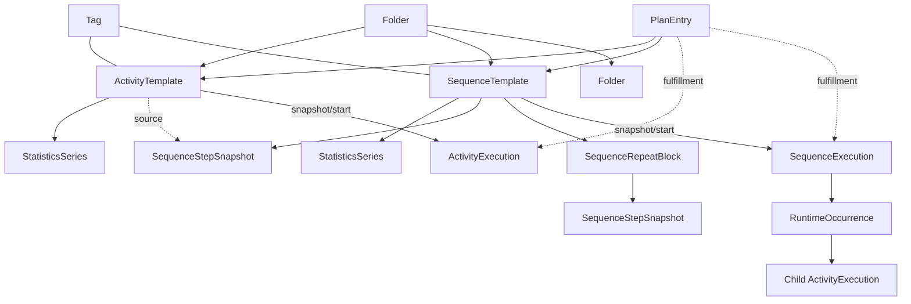

# LifeTracing — Domain Model v0.10

Дата: 2026-08-14  
Статус: **v1 domain model frozen for implementation**  
Связанный product spec: `lifetracing_product_spec_v0.16.md`

---

# 0. Цель документа

Этот файл описывает предметную область LifeTracing **независимо от UI, Room, SQLite, Compose и конкретной схемы таблиц**.

Здесь фиксируются:

- сущности и их identity;
- value objects;
- связи;
- snapshot boundaries;
- state machines;
- domain operations;
- invariants;
- stored vs derived data;
- deletion/history semantics;
- места, где решение ещё не принято.

Persistence schema должна быть выведена из этой модели позже, а не наоборот.

Статусы:

- **FIXED** — решение уже следует из product spec;
- **PROPOSED** — предлагаемая формализация существующего продуктового решения;
- **OPEN** — нужен ответ до окончательной схемы БД.

---

# 1. Glossary

## Trackable

Продуктовое обобщение сущности, которую можно:

- запланировать;
- запустить/выполнить;
- поместить в Library;
- закрепить;
- тегировать;
- получить по ней Statistics.

В первой версии есть два reusable Trackable kind:

- `ActivityTemplate`;
- `SequenceTemplate`.

Это **доменное обобщение**, а не требование иметь одну SQL-таблицу `trackables`.

## Activity

Обычное отдельное дело.

Может быть:

- Stopwatch;
- Timer;
- No live tracking.

Имеет optional Custom Fields и Main Value.

## Sequence

Composite Trackable, содержащий ordered Activity Step snapshots и Repeat blocks.

Текущая первая версия Sequence runtime mode:

`ordered_session + strict order`.

Checklist/free-order mode отложен.

## Template

Редактируемая reusable-конфигурация.

Изменение Template никогда автоматически не переписывает historical Execution.

## Snapshot

Самодостаточная копия конфигурации в конкретном контексте.

Snapshot может помнить источник (`sourceTemplateId`), но существование и поведение snapshot не зависят от дальнейшего существования Template.

## Execution

Факт реального выполнения.

History является source of truth для Statistics.

## Runtime Occurrence

Конкретный экземпляр Sequence Step внутри одного Sequence Execution.

Repeat ×3 создаёт три occurrence одного Step.

Термин внутренний; UI может его не показывать.

## Plan Entry

Запланированное будущее выполнение Trackable с planning precision Day/Week/Month.

Точная snapshot-semantics Plan Entry пока OPEN.

## Statistics Series

Стабильная статистическая identity деятельности, независимая от текущей версии Template.

---

# 2. ID types

**PROPOSED.** На domain-уровне каждый identity type должен быть отдельным логическим типом, даже если технически позже все будут UUID/String.

Минимально:

- `ActivityTemplateId`;
- `SequenceTemplateId`;
- `ActivityExecutionId`;
- `SequenceExecutionId`;
- `SequenceOccurrenceId`;
- `StatisticsSeriesId`;
- `CustomFieldId`;
- `PlanEntryId`;
- `FolderId`;
- `TagId`;
- `SequenceRepeatBlockId`;
- `SequenceStepId`.

Не использовать пользовательское `name` как identity.

---

# 3. Shared value objects

## 3.1. ShortComment

Optional короткий встроенный комментарий.

Отличается от Custom Text Field.

Snapshot-ится вместе с конфигурацией.

## 3.2. TimeTrackingMode

```text
STOPWATCH
TIMER
NO_LIVE_TRACKING
```

Для Timer дополнительно существует configured target duration.

## 3.3. PlanningPrecision

```text
DAY
WEEK
MONTH
```

Day может дополнительно иметь exact local clock time.

## 3.4. CustomFieldType

Первая версия:

```text
NUMBER
CATEGORY
TEXT
```

Rating/Boolean и другие специальные UX-типы могут позже добавляться как отдельные field types или presets, но сейчас не обязательны.

## 3.5. NumberFieldSchema

Минимально:

- `fieldId`;
- name;
- unit?;
- display precision;
- defaultValue?;
- isMainValue.

Type/name/unit не мигрируют как та же statistical identity в первой версии.

## 3.6. CategoryFieldSchema

Минимально:

- `fieldId`;
- name;
- allowed values;
- default?;
- optional metadata.

## 3.7. TextFieldSchema

Минимально:

- `fieldId`;
- name;
- default text?;

Все Custom Fields первой версии optional.

## 3.8. TrackableMetadata

**PROPOSED** общее доменное значение reusable Trackable:

- name;
- ShortComment?;
- FolderId?;
- tags;
- pinned metadata;
- createdAt;
- updatedAt.

Не обязательно хранить это одним embedded object в БД.

---

## 3.9. Field removal lifecycle

Удаление Custom Field из Template — semantic removal из будущей конфигурации, но persistence identity Field должна сохраняться как archived/soft-deleted, пока historical snapshots используют её.

Это необходимо для:
- per-field Statistics;
- source_field linkage;
- archived field display.

Новые snapshots не включают archived Field.

## 3.10. Required-field policy

**V1 FIXED:** все Custom Fields optional.

Missing — полноценное состояние и не равно zero/default.

Future extension может добавить requirement policy (`OPTIONAL / RECOMMENDED / REQUIRED`) без изменения identity Field.

Required validation не входит в v1 runtime semantics.

# 4. ActivityTemplate

## 4.1. Identity

`ActivityTemplateId` стабилен при обычном редактировании Template.

## 4.2. Mutable state

ActivityTemplate mutable:

- name;
- ShortComment;
- TimeTracking config;
- Custom Field schemas;
- Main Value designation;
- advanced Activity behavior settings;
- Folder;
- Tags;
- pin state/order;
- link на current Statistics Series.

## 4.3. Snapshot rule

При создании:

- standalone Execution;
- Sequence Step;
- возможно Plan Entry;

создаётся/используется config snapshot согласно правилам конкретного контекста.

Изменение Template после создания snapshot его автоматически не меняет.

## 4.4. Deletion

Удаление ActivityTemplate:

- не удаляет historical ActivityExecution;
- не удаляет StatisticsSeries;
- не ломает существующие Sequence Step snapshots;
- делает `Update from source template` недоступным для orphaned snapshots.

---

# 4A. Template revision and archive lifecycle

## 4A.1. Semantic revision

**FIXED.** ActivityTemplate и SequenceTemplate имеют monotonic integer `revision`.

Revision увеличивается при semantic/config edit, который должен делать существующий snapshot потенциально устаревшим.

Включаются, например:

- name;
- ShortComment;
- tracking config;
- custom fields/defaults;
- Sequence structure;
- Sequence execution settings.

Не обязаны увеличивать revision Library-only metadata:

- Folder;
- Tags;
- pinned state/order.

Snapshot хранит `sourceRevision`.

## 4A.2. Divergence

Если:

`sourceTemplate.revision != snapshot.sourceRevision`

snapshot считается source-diverged.

Это только information state.

Никакого automatic update не происходит.

## 4A.3. Soft delete/archive

Обычный Template delete = soft delete/archive.

Template сохраняет identity и source-link target.

Минимально нужен marker:

- `deletedAt?` или equivalent lifecycle status.

Archived Template:

- не показывается в основной Library;
- показывается в Archived Templates;
- не создаёт новые direct Execution через normal Library Start;
- может быть restored;
- history/Series/snapshots не удаляются.

## 4A.4. Restore

Restore возвращает тот же Template identity.

Source links снова становятся usable.

## 4A.5. Permanent purge

Полный destructive purge зарезервирован как future domain operation.

Первая кодовая версия не обязана его реализовывать.

Persistence schema не должна делать selective purge принципиально невозможным.

# 5. ActivityConfigSnapshot

Самодостаточная конфигурация Activity в конкретном контексте.

Минимально содержит:

- snapshot-local name;
- ShortComment?;
- TimeTrackingMode;
- Timer target?;
- Custom Field schema snapshots;
- default values;
- Main Value field id?;
- advanced behavior settings snapshot;
- `sourceTemplateId?`;
- `statisticsSeriesId?`;
- marker `locallyModified` там, где snapshot редактируем (например Sequence Step).

Historical ActivityExecution хранит собственный config snapshot либо достаточную эквивалентную immutable-by-source структуру.

---

# 6. SequenceTemplate

## 6.1. Identity

`SequenceTemplateId`.

## 6.2. Shared reusable metadata

SequenceTemplate имеет:

- name;
- ShortComment;
- Folder;
- Tags;
- pin state/order;
- own StatisticsSeries;
- own Custom Fields;
- own Main Value?;
- Sequence Settings.

## 6.3. Structure

Sequence содержит ordered top-level nodes:

```text
SequenceNode =
  ActivityStep
  | SequenceRepeatBlock
```

Nested Sequence запрещена.

Nested Repeat запрещён.

## 6.4. ActivityStep

Step содержит ActivityConfigSnapshot.

Если создан из ActivityTemplate:

- sourceTemplateId сохраняется;
- statisticsSeriesId Activity сохраняется;
- дальнейшее редактирование Step по умолчанию локально.

Advanced operations:

- Update from source template;
- Update source template;
- Save as new template.

## 6.5. SequenceRepeatBlock

SequenceRepeatBlock содержит:

- id;
- repeatCount;
- ordered ActivityStep children.

Поскольку nested Repeat запрещён, children SequenceRepeatBlock — только ActivityStep.

Step можно drag/drop внутрь и наружу Repeat, если результат не создаёт вложенный Repeat.

---

## 6.6. Naming boundary: SequenceRepeatBlock vs Plan Recurrence

В Kotlin/domain code предпочтительное полное имя типа:

`SequenceRepeatBlock`.

UI внутри Sequence может показывать короткое `Repeat ×N`.

Будущий механизм повторяющихся Plan называется `RecurrenceRule` и является другой сущностью.

В v1 Plan Recurrence отсутствует.

# 7. Template/snapshot propagation

## 7.1. Whole-snapshot modified flag

Первая версия не ведёт per-property override tracking.

Редактируемый Step snapshot:

- `locallyModified = false` пока не менялся локально;
- после первого локального изменения становится `true`.

## 7.2. Bulk update

ActivityTemplate может explicit обновить связанные Sequence Step snapshots:

- only unmodified;
- all, включая locallyModified, с полной заменой snapshot.

Historical Execution никогда не меняются.

## 7.3. Save as new template

Если Sequence Step выбирает `Save as new template`:

- создаётся новый ActivityTemplate;
- текущий Step начинает считать новый Template своим source.

---

# 7A. Persistence immutability of snapshots

На domain-уровне Sequence Step/Plan snapshot может «редактироваться».

На persistence-уровне snapshot row должен трактоваться как immutable.

Semantic edit выполняется как replacement:

1. build new snapshot;
2. validate;
3. atomic owner/reference swap;
4. mark old snapshot as cleanup candidate;
5. delete old snapshot только если references = 0.

Это предотвращает изменение history через shared snapshot и одновременно ограничивает orphan bloat.

# 8. ActivityExecution

## 8.1. Identity

`ActivityExecutionId`.

## 8.2. Context

ActivityExecution бывает:

- top-level standalone;
- child внутри SequenceOccurrence.

Context должен быть явным, а не выводиться только косвенно.

## 8.3. Snapshot

Execution хранит snapshot конфигурации, использованной при выполнении.

Template updates не синхронизируются назад.

## 8.4. Runtime data

В зависимости от mode:

### Stopwatch

- startedAt;
- endedAt?;
- pause intervals;
- active duration derived;
- completion reason.

### Timer

- startedAt;
- configured target;
- endedAt?;
- pause intervals;
- actual elapsed/active duration;
- natural zero/manual early/overtime reason.

### No live tracking

- completion timestamp;
- `duration = null`;
- live timer отсутствует.

Внутри Sequence собственные entered/completed timestamps occurrence хранятся отдельно.

## 8.5. Custom Field values

Execution хранит actual values.

При создании actual инициализируется configured/default value.

Missing != zero.

## 8.6. Historical edit

User может explicit менять:

- timestamps;
- actual values;
- ShortComment/исторические пользовательские данные.

Field schema не редактируется.

Overlap разрешён с warning.

---

# 9. Active Session

## 9.1. V1 live-session policy

**FIXED FOR V1, NOT A PERMANENT DOMAIN INVARIANT.**

Первая версия допускает максимум одну unfinished live session на приложение:

```text
ActivityLiveSession
or
SequenceLiveSession
```

Paused session всё равно занимает v1 active slot.

Standalone No-live completion не удерживает live slot.

Это сознательное упрощение первой версии.

Будущая модель должна поддерживать несколько параллельных live sessions, поэтому:

- ActivityExecution/SequenceExecution identity не зависит от singleton;
- history schema не содержит ограничения «может существовать только один незавершённый Execution»;
- singleton active pointer — persistence/UI policy v1, а не identity rule предметной области.

## 9.2. Persistence/recovery requirement

Live state обязан полностью переживать:

- process death;
- app restart;
- background;
- screen off.

Time state восстанавливается по persisted timestamps/state, а не по непрерывно работающему in-memory counter.

# 10. SequenceExecution

## 10.1. Identity

`SequenceExecutionId`.

## 10.2. Source snapshot

Execution должен знать достаточную snapshot-конфигурацию Sequence:

- Sequence metadata;
- Sequence-level fields/settings;
- исходный ordered structure;
- runtime-added occurrences отдельно.

Изменение SequenceTemplate не меняет active/finished SequenceExecution.

## 10.3. Runtime timeline

Хранятся/восстанавливаются:

- startedAt;
- endedAt?;
- explicit pause intervals;
- implicit idle/transition classification;
- occurrence runtime intervals;
- wall-clock span;
- derived active duration;
- derived pause/idle duration.

## 10.4. Current occurrence

Одновременно внутри strict ordered session максимум один current Step.

No-live current Step тоже является current, хотя child Activity duration отсутствует.

## 10.5. RuntimeOccurrence

Минимально:

- `SequenceOccurrenceId`;
- source step id/snapshot reference;
- repeat iteration metadata?;
- runtime position/order;
- status;
- enteredAt?;
- completedAt?;
- child ActivityExecutionId?;
- completion reason?;
- isRuntimeAdded;
- deleted/tombstone state if history edited.

## 10.6. Statuses

Минимум:

```text
NOT_STARTED
CURRENT
COMPLETED
SKIPPED
DELETED_EXECUTION
```

SequenceExecution high-level status минимум:

```text
RUNNING
PAUSED
COMPLETED
ENDED_EARLY
```

`CANCELLED` можно позже отличить от ENDED_EARLY, если появится отдельная продуктовая семантика.

---

# 11. Sequence runtime transition rules

## 11.1. Auto-advance

Auto-advance запускает следующий Step только после валидного завершения current.

Timer natural zero может завершиться автоматически.

Stopwatch всегда требует explicit finish.

No-live всегда требует explicit Complete.

## 11.2. Auto-advance OFF

После завершения Step:

- current отсутствует;
- Sequence ждёт `Start next`;
- промежуток считается implicit pause/idle.

## 11.3. Countdown

- countdown before Sequence — до `Sequence.startedAt`;
- transition countdown между Step — pause/transition interval.

## 11.4. Overtime

Explicit Step overtime override блокирует automatic transition at Timer zero.

## 11.5. Background

Auto-advance semantics не зависят от foreground.

Timer -> Stopwatch при Auto-advance ON может запустить Stopwatch в background в рассчитанный timestamp.

## 11.6. No-live Sequence accounting

По default время current No-live occurrence считается Sequence active time.

Advanced Sequence setting может классифицировать его как pause.

Это parent-session accounting, а не duration дочерней Activity.

Child No-live ActivityExecution сохраняет `duration = null` независимо от того, как Sequence классифицирует свой interval.

---

# 12. Sequence runtime editing

Первая версия intentionally ограничена.

Разрешено:

- Go now;
- Make next;
- Do again -> новый occurrence;
- one-off Add Step;
- End early.

Runtime Add Step:

- source Template или one-off config;
- snapshot только текущего SequenceExecution;
- не меняет SequenceTemplate.

Не разрешено:

- произвольный drag/reorder active run;
- drag-copy;
- изменение Repeat structure;
- nested runtime structures.

---

# 13. Historical Sequence editing

## 13.1. Child edit

Изменение child ActivityExecution может изменить derived active/pause timeline Sequence.

Пример: shortening Step создаёт idle gap, если следующий Step не сдвинут.

## 13.2. Overlap

Sequence active duration = union active intervals, не арифметическая сумма.

## 13.3. Delete child execution

Default:

- child ActivityExecution удаляется;
- occurrence остаётся tombstone `Deleted execution`.

Advanced structural removal может удалить сам occurrence.

При structural removal пользователь выбирает:

- Leave gap;
- Close gap.

## 13.4. Pause edit

Aggregate pause duration напрямую не редактируется.

Редактируются конкретные intervals/timestamps/structure; totals derived.

---

# 14. PlanEntry

## 14.1. Identity

`PlanEntryId`.

## 14.2. Snapshot semantics

**FIXED.** PlanEntry сохраняет snapshot выбранного Activity/Sequence **в момент планирования**.

После изменения source Template Plan Entry сам не обновляется.

Для Plan Entry существует explicit advanced action `Update from template`, заменяющий stored plan snapshot актуальной конфигурацией source Template.

Если source Template удалён, уже существующий Plan Entry продолжает работать по snapshot.

## 14.3. Source link

PlanEntry дополнительно сохраняет optional source:

- `sourceActivityTemplateId?`;
- или `sourceSequenceTemplateId?`.

Source link нужен для Update from template, перехода к Template и будущих подсказок. Snapshot остаётся самодостаточным.

## 14.3A. Source revision / divergence

Plan snapshot хранит `sourceRevision`.

Если source Template существует и его current revision отличается:

- Plan остаётся неизменным;
- UI может показать `Template changed`;
- `Update from template` выполняется explicit.

Если source Template soft-deleted:

- Plan остаётся выполнимым по snapshot;
- `Update from template` недоступен;
- StatisticsSeriesId snapshot сохраняется;
- Execution из Plan продолжает попадать в исходную Series;
- можно future/secondary `Save as new template`.

## 14.4. Precision

PlanEntry хранит ровно один precision:

### Day

- LocalDate;
- optional exact time.

### Week

- week identity/anchor.

### Month

- YearMonth.

Более конкретная запись отображается в более общих Plan views без создания дубликатов PlanEntry.

## 14.5. Execution linkage / fulfillment

**FIXED.** Выполнение Plan Entry происходит только explicit через сам Planned item / действие из него.

Если пользователь вручную запускает тот же Template через Start Activity, это **другое выполнение** и Plan Entry автоматически fulfilled не становится.

Execution, начатый из Plan Entry, сохраняет `planEntryId`.

Для No-live Plan:

- quick completion создаёт ActivityExecution;
- duration отсутствует;
- Main Value / Custom Fields заполняются через обычный quick-completion flow;
- Plan Entry сразу становится fulfilled.

## 14.6. Просроченный Plan

**FIXED.** Невыполненный Plan никогда не переносится автоматически.

Day Plan остаётся невыполненным в исходном Day. Week/Month Plan также остаётся в исходном периоде, пока пользователь explicit не выполнит reschedule.

Future UI может иметь отдельный `Overdue` list/filter, но это не меняет domain semantics.

## 14.7. Lifecycle state

**FIXED.** Stored PlanEntry status:

```text
PLANNED
FULFILLED
CANCELLED
```

`OVERDUE` не хранится.

Это derived state:

- stored status = PLANNED;
- planned target period/Instant уже прошёл.

Reschedule в первой версии меняет temporal target того же PlanEntry.

Отдельная history reschedule events пока не хранится.

`Overdue` означает просроченный Plan, а не слишком долго идущее Activity.

## 14.8. Recurrence

Recurrence **не входит в первую кодовую версию**.

Не путать Sequence `SequenceRepeatBlock` и будущий Plan `RecurrenceRule`.

## 14.9. Timezone semantics — первая версия

History и Plan используют разные правила.

### Historical Execution

- абсолютный timestamp не меняется;
- ZoneId/offset контекста выполнения фиксируется в истории;
- отображение исторического local time не пересчитывается задним числом при смене timezone телефона.

### Exact-time Plan

Первая версия ведёт себя как **absolute-time anchored** plan:

- пользователь задаёт local date/time в текущей timezone телефона;
- при сохранении вычисляется absolute Instant;
- после перелёта тот же Plan отображается в текущей timezone телефона как тот же Instant.

Пример: 15:00 UTC+3 -> после перелёта в UTC+2 отображается как 14:00.

### Day/Week/Month Plan без exact time

**FIXED.** Это floating calendar values.

- Day остаётся literal LocalDate;
- Week остаётся literal calendar week;
- Month остаётся literal YearMonth.

Они не конвертируются через Instant при смене timezone.

Future advanced feature может дать дополнительные timezone policies, но v1 использует именно floating calendar semantics.

## 14.10. State transitions and timestamps

### cancelPlan

Allowed:
`PLANNED -> CANCELLED`

Effects:
- `cancelledAt = now`;
- `fulfilledAt = null`;
- entry исчезает из normal Plan views;
- temporal target/snapshot не меняются.

### restoreCancelledPlan

Allowed:
`CANCELLED -> PLANNED`

Effects:
- `cancelledAt = null`;
- original planned target сохраняется;
- если target уже в прошлом, `overdue` снова вычисляется dynamically.

### fulfillPlan

Allowed:
`PLANNED -> FULFILLED`

Только через explicit linked Execution/quick completion из Planned item.

Effects:
- `fulfilledAt = completion time`;
- `cancelledAt = null`;
- linkage на Execution сохраняется.

### delete linked fulfilled Execution

Plan автоматически не возвращается в PLANNED.

Он остаётся FULFILLED, а linkage указывает на soft-deleted/missing historical execution.

### reschedule

В v1 разрешён для PLANNED entry и меняет temporal target того же PlanEntry.

Отдельная reschedule history не хранится.

# 15. StatisticsSeries

## 15.1. Identity

`StatisticsSeriesId`.

## 15.2. Purpose

Series — стабильная statistical identity, объединяющая Execution одной деятельности независимо от текущей версии/наличия Template.

Series **не является самими Execution** и не является копией Template.

Template редактируется — Series по default не меняется.

Advanced operation:

`Start new statistics from here`.

## 15.3. Association

Template хранит `currentStatisticsSeriesId`.

Execution/snapshot сохраняют StatisticsSeriesId, куда относится конкретное выполнение.

Это позволяет исторической принадлежности переживать:

- изменение Template;
- удаление Template;
- создание Execution из старого Plan snapshot;
- создание Execution из Sequence Step snapshot.

## 15.4. Template soft-delete

Soft-delete Template не удаляет Series.

Важно: Series не обязательно становится «неактивной».

Она может продолжать получать новые Execution через:

- Plan snapshots;
- Sequence Step snapshots;
- другие source-linked snapshots.

Поэтому status Series не должен автоматически равняться status Template.

UI может показывать `Source template archived`.

## 15.5. Restore Template

Если тот же soft-deleted Template восстановлен:

- identity Template сохраняется;
- revision сохраняется/продолжается;
- currentStatisticsSeriesId остаётся тем же;
- новые direct Execution снова попадают в ту же Series.

## 15.6. One-off internal bucket

Существует служебный aggregate `One-off activities`.

Это не Library Template и не полноценная per-activity identity для child one-off Sequence Step.

# 16. Statistics invariants

Global tracked time считает только top-level:

- standalone ActivityExecution;
- SequenceExecution.

Child Activity внутри Sequence не удваивают global total.

Per-Activity Statistics могут включать child ActivityExecution Sequence, если у них есть StatisticsSeries identity.

No-live Execution:

- участвуют в count/frequency/field stats;
- не считаются duration=0.

Field Statistics:

- Missing != 0;
- old archived fields остаются статистически доступны;
- type/name/unit replacement создаёт новую field identity.

History edit инвалидирует/пересчитывает соответствующие aggregates.

StatsCache, если появится, является derived cache, а не source of truth.

---

# 17. Folder

## 17.1. Identity

`FolderId`.

## 17.2. Tree

Folder имеет optional parent Folder. Cycle запрещён. Глубина технически не ограничивается.

## 17.3. Membership

**FIXED.** Reusable ActivityTemplate/SequenceTemplate находится максимум в одной Folder.

`folderId = null` означает Library root.

Folder = location. Tag = many-to-many classification.

## 17.4. Bulk selection / move

Library должна поддерживать multi-select reusable items и массовое перемещение в:

- другую существующую Folder;
- root / без папки;
- новую Folder.

## 17.5. Delete Folder

Удаление непустой Folder не должно silently cascade.

Пользователь выбирает как минимум между:

- `Move contents` — выбрать destination Folder или root;
- `Delete contents` — explicit destructive branch.

Safe/default branch = Move contents.

Если пользователь хочет часть перенести, а часть удалить, он делает это отдельными операциями через multi-select.

Nested Folder при `Move contents` переносится **целиком как subtree**. Автоматического flatten нет.

Удаление Templates внутри destructive branch всё равно следует Template soft-delete semantics: historical Execution и Statistics Series сохраняются.

Отдельное destructive действие `Delete template and historical data` может существовать глубоко в advanced menu, но не является обычным default delete flow.

# 18. Tag

`TagId`, name и будущая presentation metadata.

**FIXED.** Tags — many-to-many classification reusable Trackable.

Первая версия:

- Tags относятся к текущей Library organization metadata;
- Tags **не snapshot-ятся** в historical Execution;
- изменение/удаление Tag не переписывает historical Activity data, потому что historical tag membership вообще не хранится.

Statistical Groups остаются отдельной future concept и не требуют от Tags быть исторической аналитической системой.

Удаление Tag удаляет classification links, но не Activity/Sequence Template и не историю.

# 19. Pinned / Recent

## 19.1. Pinned

Pinned не является копией Trackable.

**PROPOSED:** хранить user ordering, а не только boolean.

Pinned применяется к reusable Activity/Sequence.

## 19.2. Recent

Recent — derived view из последних запусков/выполнений reusable Trackable.

Не требуется отдельная source-of-truth сущность, если его можно эффективно вывести из history/recent-use cache.

---

# 20. One-off Activity

One-off Activity не имеет ActivityTemplateId.

Она всё равно имеет ActivityConfigSnapshot и ActivityExecution.

Может иметь TimeTracking, ShortComment, Custom Fields и Main Value.

Не появляется в Library автоматически.

### Top-level standalone one-off

Global Statistics относит такие Execution во внутренний служебный bucket `One-off activities`. Этот bucket не является Template.

### One-off child Step внутри Sequence

**FIXED.** Если Sequence Step создан вручную без ActivityTemplate/source StatisticsSeries:

- его child ActivityExecution не получает отдельную per-Activity Statistics Series;
- он остаётся частью Sequence history;
- global tracked time всё равно учитывается только через top-level SequenceExecution;
- поэтому one-off child Step не попадает в standalone `One-off activities` bucket и не создаёт двойного учёта.

В будущем такой Step можно сохранить как Template и начать собирать устойчивую per-Activity Statistics Series с будущих Execution.

# 21. Domain operations

Минимальный набор операций на уровне предметной области, а не UI:

## Activity

- createTemplate
- editTemplate
- deleteTemplate
- createSnapshot
- startStandaloneExecution
- completeNoLiveExecution
- pauseExecution
- resumeExecution
- completeExecution
- editHistoricalExecution
- deleteHistoricalExecution

## Sequence

- createSequenceTemplate
- editSequenceTemplate
- addStep
- addSequenceRepeatBlock
- moveStep
- duplicateStep
- autoInsert
- updateStepFromSourceTemplate
- updateSourceTemplateFromStep
- saveStepAsNewTemplate
- startSequenceExecution
- pauseSequence
- resumeSequence
- completeCurrentStep
- startNext
- goNow
- makeNext
- addRuntimeStep
- doAgain
- endSequenceEarly

## Plan

- createPlanEntry
- reschedulePlanEntry
- startFromPlan
- markPlanFulfilled / derive fulfillment — OPEN detail
- delete/cancelPlanEntry

## Library

- moveTemplateToFolder
- pinTemplate
- unpinTemplate
- addTag
- removeTag

## Statistics

- startNewStatisticsSeries
- calculateAggregates
- invalidateDerivedCache

---

# 22. Core state machines

## 22.1. Standalone live Activity

```text
NOT_STARTED
    |
    v
RUNNING <----> PAUSED
    |
    v
COMPLETED
```

Historical edit не возвращает Execution в live RUNNING.

## 22.2. No-live standalone

```text
READY
  |
  | Complete / quick completion
  v
COMPLETED
```

## 22.3. SequenceExecution

```text
NOT_STARTED
    |
    v
RUNNING <----> PAUSED
   |  \
   |   \ End early
   |    v
   |  ENDED_EARLY
   v
COMPLETED
```

В RUNNING может временно отсутствовать current Step при Auto-advance OFF; это implicit idle, а не отдельный high-level status.

---

# 23. Stored vs derived data

## Stored source data

Хранить явно:

- identities;
- Template configs;
- snapshots;
- Execution timestamps;
- actual Custom Field values;
- pause intervals/events;
- Sequence occurrence timeline/state;
- Plan precision/value;
- Template/Series linkage;
- Folder/Tag relationships;
- source links;
- runtime-added markers;
- deletion/tombstone metadata.

## Derived

Вычислять, возможно кэшировать:

- Activity active duration;
- Sequence wall span;
- Sequence active duration;
- Sequence pause/idle duration;
- averages;
- medians;
- min/max;
- active days;
- frequency;
- Recent list;
- Statistics field coverage.

Derived cache всегда можно пересобрать из source data.

---

# 24. Deletion principles

## Template

Обычный delete = soft archive.

Не cascade на Execution/Statistics/snapshots.

Permanent purge — future/advanced.

## Historical Execution

Удаляется explicit user action.

Если child Sequence occurrence — default tombstone; advanced structural removal отдельно.

## Statistics Series

Template archive не удаляет Series.

Series может продолжать получать Execution из сохранённых Plan/Sequence snapshots.

## Folder

Непустая Folder удаляется только через explicit `Move contents` / `Delete contents`.

Nested Folder при move переносится subtree.

## Tag

Удаление Tag удаляет только current classification links.

Historical tag snapshot v1 не хранится.

## Plan Entry

`CANCELLED` хранится отдельно и может быть Restore -> `PLANNED`.

Permanent purge Plan — future/advanced.

---

# 25. Time and timezone — fixed v1 semantics

Executions требуют absolute timestamps для background/restart.

Plans имеют две разные temporal semantics.

## 25.1. Historical Execution

**FIXED.**

Хранить:

- absolute Instant;
- original ZoneId и/или offset context, достаточный для восстановления original local time.

Historical display по default использует original event-local time.

Смена timezone устройства не меняет задним числом дату/время истории.

## 25.2. Exact-time Plan

**FIXED.**

Пользователь вводит local date/time в текущей timezone устройства.

При сохранении Plan получает absolute scheduled Instant.

При смене timezone устройства:

- Instant остаётся тем же;
- displayed local clock time пересчитывается в текущую timezone.

Пример:

15:00 UTC+3 -> 14:00 UTC+2.

Для audit/debug можно сохранить creation ZoneId, но runtime semantics определяет Instant.

## 25.3. Day Plan без exact time

**FIXED.**

Хранится floating `LocalDate`.

Он не конвертируется через timezone.

После перелёта Plan показывается тогда, когда **текущая local calendar date устройства** совпадает с сохранённым LocalDate. Повтор/скачок календарного дня при путешествии принимается как нормальная v1 semantics.

## 25.4. Week Plan

**FIXED.**

Хранится floating calendar-week identity.

Persistence representation должна быть однозначной и query-friendly, например:

- weekStart LocalDate + week-definition policy;
- или ISO week-year/week number, если продукт фиксирует ISO weeks.

Конкретный storage format выбирается на persistence-design этапе.

## 25.5. Month Plan

**FIXED.**

Хранится floating `YearMonth`.

## 25.6. Statistics day boundary

**FIXED для первой версии.**

Historical Execution группируется по original local date события.

Future alternate reporting timezone может быть добавлена отдельно, не меняя source timestamps.

# 26. Relationship sketch



Diagram conceptual only; cardinalities below.

---

# 27. Cardinalities — current proposal

```text
ActivityTemplate  N -> 1 StatisticsSeries
SequenceTemplate  N -> 1 StatisticsSeries   (future merge-compatible)

Folder            1 -> N child Folder
Folder            1 -> N reusable Trackable
Reusable Trackable 0..1 -> 1 Folder

ActivityTemplate  1 -> N source-linked SequenceStepSnapshot
SequenceTemplate  1 -> N SequenceNode

SequenceExecution 1 -> N RuntimeOccurrence
RuntimeOccurrence 0..1 -> 1 ActivityExecution

Reusable Trackable N <-> N Tag

PlanEntry 1 -> 1 selected Trackable/source   [snapshot semantics OPEN]
Execution 0..1 -> 1 PlanEntry                [fulfillment semantics OPEN]
```

---

# 28. Invariants for implementation/tests

1. Сейчас максимум одна live session.
2. Paused live session занимает slot.
3. No-live standalone не оставляет live session.
4. Template edit не меняет historical Execution.
5. Template deletion не удаляет history.
6. Sequence Step snapshot самодостаточен.
7. Nested Sequence запрещена.
8. Nested Repeat запрещён.
9. Один strict Sequence run имеет максимум один current occurrence.
10. Auto-advance не завершает Stopwatch без explicit finish.
11. No-live current требует explicit Complete.
12. Timer overtime override блокирует zero auto-transition.
13. Missing field != zero.
14. Default field value становится actual, если пользователь не изменил.
15. Global tracked time не задваивает child Activity Sequence.
16. Sequence active time = union active intervals с учётом classification rules.
17. Inter-step wait без current = pause/idle.
18. Transition countdown = pause/transition.
19. Pre-sequence countdown вне Sequence runtime.
20. Historical overlap разрешён, но active union не превышает wall span из-за двойного счёта.
21. Runtime-added Step не меняет SequenceTemplate.
22. Completed Step не переоткрывается; Do again создаёт новый occurrence.
23. Field type/name/unit не мигрируют как та же statistical identity.
24. StatsCache не source of truth.
25. Folder tree не содержит cycle.
26. Library one-off Execution не создаёт Template автоматически.

---

# 29. Decisions incorporated in v0.2

Закрыты:

1. Plan stores snapshot + explicit Update from template.
2. Plan fulfillment only through explicit Plan linkage; no automatic matching by same Template.
3. Overdue Plan is not automatically rescheduled.
4. One reusable Trackable belongs to at most one Folder.
5. Folder delete is explicit move/delete flow.
6. Tags are current organization metadata and are not snapshotted to history.
7. One-off child Step inside Sequence has no standalone Statistics Series.
8. Recurrence is excluded from first coded version.
9. Historical timezone is fixed; exact-time Plan is absolute-time anchored and displayed in current device timezone.
10. No-live Plan completion immediately fulfills linked Plan Entry.

# 30. Decisions incorporated in v0.3

Закрыты:

1. Broad Day/Week/Month Plan — floating calendar values.
2. Full Template+history purge отложен, но persistence не должна его запрещать.
3. StatisticsSeries переживает Template deletion и может продолжать получать Execution из snapshots.
4. Folder subtree переносится целиком.
5. Plan snapshot остаётся выполнимым после source Template deletion.
6. Plan может показывать `Template changed`.
7. Template использует monotonic semantic revision; snapshot хранит sourceRevision.
8. Обычное Template delete = soft archive; Archived Templates можно восстановить.
9. Plan statuses = PLANNED/FULFILLED/CANCELLED; overdue derived; reschedule меняет тот же PlanEntry.
10. Execution из archived-template snapshots продолжает попадать в исходную StatisticsSeries.

---

# 31. Decisions incorporated in v0.4

Закрыты:

1. Fulfilled Plan остаётся в исходном planned period; archive source Template ничего в прошлом не меняет.
2. Start new statistics semantics подтверждена.
3. Restore похожих/одноимённых Templates не выполняет merge автоматически.
4. Pinned имеет пользовательский порядок и поддерживает reorder.
5. Recent обновляется по фактическому использованию Template, включая early-ended execution.
6. Numeric persistence должна использовать numeric semantics, не lexical TEXT comparison.

## 31.1. Numeric value persistence direction

**PROPOSED for database schema.**

Для Number Custom Field первая версия использует fixed storage scale `1000`.

```text
stored = round(userValue * 1000)
```

Storage type — signed 64-bit integer.

Плюсы:

- exact до 3 знаков после запятой;
- корректные SQL sort/comparison/min/max/sum;
- отсутствие binary floating-point artifacts;
- намного проще TEXT decimal parsing/indexing.

`displayPrecision` остаётся отдельной настройкой Field и не меняет stored scale.

Statistics:
- sum можно считать как integer;
- count integer;
- average = exact sum/count с нужным округлением в domain/app layer;
- median вычисляется по numeric integer ordering.

Не хранить numeric Custom Field как TEXT только ради decimal exactness.

## 31.2. Statistics Series from archived sources

**FIXED.**

Plan snapshot / Sequence Step snapshot сохраняет `statisticsSeriesId`.

Если source Template позже archived/deleted, новые Execution из этого snapshot всё равно записываются в ту же Series.

Series lifecycle не зависит от lifecycle Library Template.

---

# 32. Final decisions incorporated in v0.5

## 32.1. Snapshot-local name

ActivityConfigSnapshot имеет собственное `name`.

Правила:

- при создании из Template snapshot.name = Template.name;
- snapshot.name может редактироваться независимо;
- source Template.name не меняется;
- StatisticsSeriesId не меняется;
- ShortComment остаётся отдельным полем.

Это применимо к:

- Plan snapshot;
- Sequence Step snapshot;
- Activity Execution snapshot;
- one-off Activity config.

## 32.2. Cancelled Plan

PlanEntry status:

```text
PLANNED
FULFILLED
CANCELLED
```

Cancelled entry:

- исключается из обычных Plan queries/views;
- хранится для истории намерений;
- может быть Restore -> PLANNED;
- не считается overdue;
- не auto-reschedule.

Если restored period уже прошёл, `overdue` снова вычисляется как derived state.

## 32.3. Plan archive/management

Domain operations:

- cancelPlan(planEntryId)
- restoreCancelledPlan(planEntryId)
- purgePlan(planEntryId) — future/advanced

Cancelled Plan должен быть queryable отдельно.

## 32.4. Database-readiness status

На уровне продукта/domain закрыты решения по:

- Activity/Sequence;
- Templates/snapshots;
- Execution/history;
- Plan;
- Statistics Series;
- Folder/Tag;
- archive lifecycle;
- timezone semantics;
- one-off;
- numeric field direction.

Дальнейшие вопросы считаются persistence/implementation questions, если они не меняют пользовательскую семантику.

# 33. External review resolutions

## 33.1. Interval union location

Union active intervals рассчитывается в domain/application layer, не в Room DAO.

Algorithm for one SequenceExecution:
1. load relevant intervals ordered by `startedAt`;
2. take ACTIVE intervals;
3. merge overlapping/adjacent ranges;
4. sum merged lengths.

Complexity is linear after ordered load.

Persistence may cache final per-execution durations; timeline remains source of truth.

## 33.2. Snapshot cleanup

Normal edit operations must immediately prune replaced snapshots if unreferenced.

A separate safety maintenance pass may remove orphan snapshots left after interrupted/migrated operations, but correctness must not depend on periodic GC.

## 33.3. Field identity — OPEN

Предлагаем изменить прежнее слишком жёсткое правило:

- Field `id` remains stable on display-name rename;
- rename does not split Statistics;
- type remains immutable in v1;
- unit remains immutable in v1;
- semantic replacement => new Field id.

Category option label rename similarly may preserve option id.

Нужно подтверждение пользователя.

# 34. Field display inheritance — final domain rule

## 34.1. Identity vs label

`CustomFieldId` — statistical/domain identity.

`displayName` — mutable presentation metadata.

Rename displayName не создаёт новый Field и не разрывает Statistics.

## 34.2. Snapshot representation

Snapshot Field концептуально хранит:

- `sourceFieldId?`;
- `nameAtCreation`;
- `localNameOverride?`;
- snapshot type/unit/default/schema data.

Effective display name:

```text
if localNameOverride != null:
    localNameOverride
else if sourceFieldId exists and source Field metadata is available:
    sourceField.currentDisplayName
else:
    nameAtCreation
```

## 34.3. Historical display

History не обязана показывать label exactly as it was written on execution date.

Для source-linked Field без local override она показывает **current corrected source label**.

Это осознанное исключение из immutable historical presentation:
- values/timestamps/config semantics не меняются;
- только reusable display metadata Field может исправляться глобально.

`nameAtCreation` остаётся stored fallback/audit data.

## 34.4. Local modification boundary

Локальное изменение Activity snapshot name/ShortComment/Timer/etc. не создаёт local Field-name override.

Override создаётся только если пользователь явно переименовал конкретный Field в этом snapshot/context.

Поэтому concrete Activity может иметь своё Activity name, но Field labels всё ещё наследуют source Template labels.

## 34.5. One-off

Если `sourceFieldId = null`, Field полностью локальное и не получает будущих rename source Template.

## 34.6. Category options

Category option имеет stable option identity.

Label rename сохраняет identity и category Statistics.

Snapshot хранит:
- sourceOptionId?;
- labelAtCreation;
- localLabelOverride?.

Effective label определяется аналогично Field name.

## 34.7. Revision interaction

Global Field display-name rename **не обязан увеличивать semantic Template revision**, потому что:
- execution behavior/schema identity не меняется;
- linked snapshots автоматически видят новый label.

Он увеличивает metadata/update timestamp Field.

Если в будущем нужен отдельный presentation revision, его можно добавить без изменения Statistics identity.

Type/unit/default/structure changes по-прежнему подчиняются semantic Template revision rules.


# 35. Per-Field override precedence — final rule

Для каждого source-linked Field inheritance определяется независимо.

Effective Field name:

```text
localNameOverride
    ?? sourceField.currentDisplayName
    ?? nameAtCreation
```

Пример:

```text
Template:
  Field A = Amount
  Field B = Difficulty

Snapshot:
  Field A local override = Glasses
  Field B no override

Later Template rename:
  Field A -> Cups
  Field B -> Effort
```

Snapshot/history result:

```text
Field A = Glasses
Field B = Effort
```

Это правило не зависит от того, был snapshot:
- выполнен;
- запланирован;
- встроен в Sequence;
- создан как standalone source-linked Activity.

Локальный rename Activity name/ShortComment/другого Field не влияет на inheritance этого Field.

# 36. Calendar edge resolved

Midnight ownership confirmed:

- timed Activity -> local date startedAt;
- Sequence -> local date startedAt;
- No-live -> local date completedAt;
- v1 duration attribution uses whole execution on primary day.

Detailed split-at-midnight reporting is future.

# 37. Primary local date — final v1 rule

Каждый completed/running top-level timed Execution имеет deterministic `primaryLocalDate`.

## Activity

Timed Stopwatch/Timer:

```text
primaryLocalDate =
    localDate(startedAt, originalZoneId)
```

No-live:

```text
primaryLocalDate =
    localDate(completedAt, originalZoneId)
```

## Sequence

```text
primaryLocalDate =
    localDate(startedAt, originalZoneId)
```

В v1 whole-execution Statistics attribution использует тот же primary day.

Source timestamps остаются точными, поэтому future reporting может split duration by midnight.

# 38. Activity creation modes

Создание ActivityExecution имеет не только `start now`.

## 38.1. Live now

```text
startedAt = now
completedAt = null
status = RUNNING
```

## 38.2. Backdated live start

```text
startedAt = userSelectedPastInstant
completedAt = null
status = RUNNING
```

Execution уже считается идущим с указанного startedAt.

Создание row позднее startedAt не меняет semantic start.

## 38.3. Manual completed historical Activity

```text
startedAt = userSelectedPastInstant
completedAt = userSelectedPastInstant
status = COMPLETED
```

для timed Activity.

Для No-live:

```text
startedAt = null
completedAt = selectedPastInstant
status = COMPLETED
```

## 38.4. Invariants

For timed historical Activity:

```text
startedAt <= completedAt <= now
```

For backdated live:

```text
startedAt <= now
```

Cross-midnight is ordinary because comparison uses Instant/full date-time, not clock-only values.

Overlap with other Execution is allowed with warning.

## 38.5. Manual Timer

Historical completed Timer does not replay timer-zero automation.

Its:
- target remains snapshot configuration;
- actual duration follows entered interval;
- completion reason = `MANUAL_HISTORY_ENTRY`.

## 38.6. Pauses

Initial manual historical interval v1 contains no inferred pause intervals.

Thus:

```text
activeDuration = completedAt - startedAt
```

unless the user later explicitly edits pause/timeline data through a future/advanced history editor.

No silent pause inference.

## 38.7. Plan

Manual completed Activity created from a PlanEntry is explicit Plan fulfillment.

The identical Activity entered through ordinary Start/manual-history flow does not auto-match a Plan.

## 38.8. Timezone

Manual date/time is interpreted using an explicit event ZoneId.

UI default = current device ZoneId.

The ZoneId is persisted as original event zone.

Future UI may expose ZoneId override without schema change.

# 39. Remaining non-database product edge

Backdated/manual Sequence creation remains intentionally unresolved.

Reason:
- root Sequence start time does not identify current Step;
- earlier child completion/skip/repeat state cannot be inferred.

Recommended v1:
- standalone Activity supports backdated live/manual history;
- Sequence starts normally from its first runtime occurrence;
- manual Sequence backfill postponed until its child-timeline UX is designed.

The database model itself can later store such a Sequence because SequenceExecution/occurrences/intervals already support historical timestamps.

# 40. Implementation-boundary rules after final review

## 40.1. Draft vs persisted snapshot

Persistence snapshot is not an editor draft.

A user may edit many properties locally before one semantic command is committed.

Domain command receives the final draft aggregate and produces at most one replacement snapshot per owner per commit.

This keeps snapshot immutability without turning keystrokes into database churn.

## 40.2. Effective Field metadata resolver

Effective Field label is a domain projection:

```text
local override
?? current source metadata
?? creation fallback
```

Repository may fetch source metadata separately/batched and map in Kotlin.

Domain semantics do not require a single SQL join tree.

## 40.3. Plan window projection

PlanRepository exposes calendar-oriented projections rather than leaking persistence split to UI.

For a local calendar window it combines:
- floating Day entries selected by LocalDate;
- exact-time entries selected by Instant window derived from current ZoneId.

Week/Month broad entries remain separate higher-level collections.

ZoneId change invalidates/rebuilds this projection.
